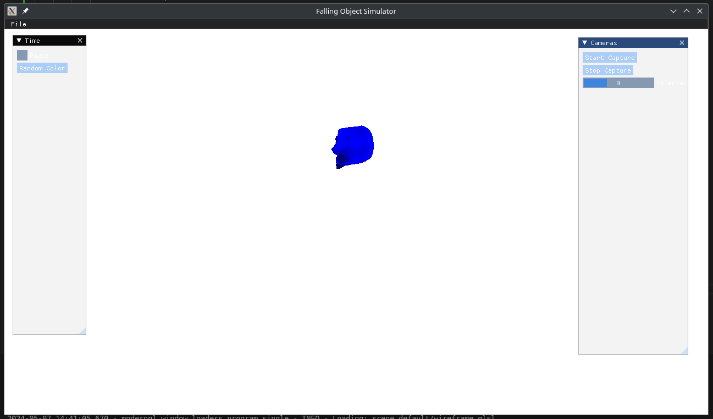

# Freefalling Rigid Body Simulator
Samuel Schug

## Introduction

At NAVAIR a primary type of testing procedure involves photogrammetric analysis of video sequences of freefalling rigid bodies. Such tests often involve equipment and payloads costing hundreds of thousands of dollars, and thusly such tests are inherently prohibitive. At the same time, modern computer vision models require vast amounts of data in order to generalize. Addressing this, we desire a means by which we can produce realistic image sequences which are customizable with respect to trajectory, camera positioning, and luminosity.

Entering computer graphics, the content of the course has so far covered most of the primary components of such a system. We require a world space, multiple cameras, and a model, where the model moves according to Newtonian physics (lets assume at most 4th order for this excersise). We additionally have a bay from which the object is dropped. These components cover the core mechanism underlying the simulator, however since we require a tolerable degree of realism, we look to rendering techniques such as ray-tracing which have become increasingly popular in recent years. This style of rendering is ideal for our intentions since we are mainly concerned with realistic lighting and only need to generate a few hundred frames per simulated test.

In the following section we establish a plan for achieving this in a staged fashion which will lead to the successful completion of the project.

## PLAN OVERVIEW:

### PRIMARY MILESTONES:
* object in freefall with a single observer (7)
    * world (with physics - mass, gravity, possible sequenced initial impulse)
    * object model (does not matter)
    * camera
    * lighting
* multiple observers and varied initial conditions (initial observer/object positions, initial impulse) derived from a config file (2)
* recording/saving observed perspectives to disk (1)
  
### ADVANCED MILESTONES:
* advanced virtual camera configuration (framerate, focal length, pixels) (1)
* drop bay with realistic lighting (it is dark in the bay until it opens to drop) (3)
* ray-tracing-based rendering (2)

Primary milestones should be completed initially, with ordering determined by the associated (weight). A minimal final product needs to have at least a score of 10 in this plan, where total completion has a score of 15.

In the following section we establish a set of guidelines for getting the needed technology implemented and or derived from an existing implementation

## TECHNICAL OVERVIEW:

Overall, we should seek a framwork which enables us to implement at least all of these requirements. Given the courses emphasis on OpenGL, we would want to work with something at least as high level as this. [The eventual goal being that we want an relatively efficient drop in ray-tracing renderer]. The framwork also needs to be configurable enoguh to enable saving the video stream to disk since this would ideally be the deliverable.

## PROGRESS LOG:
Preface: This log portrays the progress of the project by documenting the trials and tribulations of a graphics programmer trying his best to just get it working. The first part is written posthumously before the programmer died and was reborn as a different programmer who actually logs things with correct timestamps.

Prototyping Phase:
First approaches prior to initializing logging consisted of trying a C++ implementation of a simple ball falling, where we treat the object as a point and just drop it.
Basic functionality included an Object class which had vertical position, velocity and acceleration and for fun I made it bounce (handling when position=0 and then just setting negating the current velocity). This was cool and all, however the big issue is that I had no idea how to do anything more complicated than a ball, besides the stanford teapot, since these models are included by default in glfw. Then enters assimp. This is OpenGL book's goto asset loader and is supposed to support a wide array of different object formats. After installing and configuring some basic loader code, I found that no matter how I tried it would not produce any change. This is when I realized that I had totally forgort about shader code. Attempting to resolve this, I followed the OpenGL section on shaders. After dilligently following their guidance, I quickly found myself in a big mess of code which would not compile because I had not linked all of the libraries correctly. Long story short, C++ coding is wonderful and probably a good standard, but I am too low-minded and time is too short to worry about low-level things on end. 

This is about where I decided to port everything to pyOpenGL. The port took like 30 minutes and I was able to get all the functionality I ever wanted and the universe was in harmony… except the model still wouldnt show up. This is about where I took a long break and reflected upon what I was doing wrong. I came to the conclusion that doing everything from scratch and still trying to focus on the higher objective of getting a working deliverable were not that compatible. Then enters BillSix's mpVisualization code. Sleek, simple interface, paddles, cameras, lighting, shaders, the works. All I had to do was strip it down to it's core components, namely objects and cameras and the rest would be easy, it even has a simulation loop. In this framing things got alot further, and the physics became full-featured, with position, velocity, acceleration and their respective angular components all simulated, we can apply initial velocities and simulate bouncing once again… but for paddles. I had forgot that I also want to be able to load in an arbitrary object file. This was not covered by mpVisualization so we have to step back and see if we can get assimp in python? Well you can, and the first result is something called pyAssimp, which promises to be a high level interface to assimp. The only problem is that their loader produces a nightmarish geometric hellscape of purple, then gray, then all of the colors of the rainbow. Something is wrong. It turns out that pyAssimp blows and has been mostly abandoned for a while now, or at least that is how it seems. Now I need to load objects, and it seems assimp for python is a no-go. Except it isnt, and there is an even lower interface (oh no) which is basically just assimp but in python. The loader is simple but mysterious and their syntax is basically just the same as the C++ one. Long story short, this also didnt work, the loader either produced said geometric rainbow hellscape, and looking at the source code for the wrapper is hard because it is not properly typehinted. Oh and also because I didnt know if it was the object I was trying to load or what (it was just the Survival Backpack that the OpenGL model loading section advocates), so we whipped out blender and sculpted a strange looking creature from a cube; eyes, lips, nose, random ridges, all artistically crafted by yours truly. We will hopefully be dropping him thousands of times soon and he will pray each night that we do not care to simulate pain.

This has been much too much to get basic functionality, so we really need to step back once again (oh no) and figure out the best ways to do OpenGL things in Python. After a bit of looking we enter moderngl, a python package which promises to be a more modern, higher level, and pythonic binding to OpenGL libraries with lots of fancy integrations. And they have an example where they can load and render arbitrary object files (I think they use pyWavefront, so only .obj ): ). And they have textures (which can be applied with a single function). And the syntax is familiar. And they have an imgui extension. Now all we have to do is port everything once again, and this time everything will just work, right? This time it actually worked, and we have good (point) physics, and with this success we have learned just one thing: Python can be nice sometimes, especially if you are coding in Python and not frankenC++Python (a euphimism for lazy C++ to Python bindings).With a working prototype, we are ready to start a github repo, start doing version control, keeping better logs, and a million other things we probably should have done from the beginning.

5/6/2024: 

Task: Implement actually realistic physics
Overview: Our physics system deals with gravity on point objects, but does not realistically simulate their mass, mechanisms by which angular movement can occur (center of mass), or applying initial force to an object. In order for this to be a proper simulation this must happen. 

Strategy: Now that we have access to the vertex data we can use it to calculate the center of mass or maybe I can just treat every vertex as having mass and the fill in the interior with a fake grid of points which are all 'rendered' by some point object at the center of the earth. IDK, the second option sounds cool but hard, so I will probably implement the first and the whip up some weird assymetric objects to test.

Task: Save data from the camera to a file
Overview: We can simulate freefalling objects all day, but the big thing we need is to record what went down and get it into a file for later playback. This seems somehow different that the usual graphics stuff, but hopefully we dont have to manually get into bytestreams or anything so horrid. 

Strategy: We are already rendering it and sending it to screenspace, but what we might want to do is to send the frame to a file, like an image, then we can stitch the images together into a video. Or maybe someone has already thought of this, but honestly it doesnt seem too bad. 

Task: Better lighting/Photorealism
Overview: Silly looking floating heads being dropped is good for fun but setting our sights higher demands that we make imagery that can at least trick a human if we are to trick the robot into thinking it is looking at reality. This means we want to produce video that if you took squinted really hard you might not know that it is a simulation. 

Strategy: I feel this is pretty open ended and there are alot of loose ends to hang up. I might want to implement a skybox or something similar to make it look like we are not in a depthless void. I should also see if there are any shader tricks we can pull to make things fancy, which is likely just looking at the sorts of things people can do with shaders for realism. 

Updates: 
Saving the video output for the current frame buffer turns out to be fairly easy. ModernGL has a capture extension which supports ffmpeg so it is as simple as rigging it to imgui buttons. This required setting up a proper config dictionary which should be extensible enough to store initial information as we wanted. Multiple cameras is pretty easy too, we just make an extra camera object with a different location and swap with a button.

5/7/2024: 

Updates: 
Multiple cameras changeable from a slider is also a cinch, I now have a list of cameras which are selectable from an imgui slider and the renderer uses the currently selected camera

Recording all 4 cameras (there are 4 cameras now) is less easy. The idea was that we just create a standalone context and create separate framebuffers for each camera and write the buffer to a file with ffmpeg. The problem with this is that we make a call to the object's render each time we render for each framebuffer, and the way it is rigged up, rendering updates physics, so we are now applying gravity each time. The result is in the [hyperbounce.mp4] video, and we get alot more acceleration than was probably wanted. This also lags out the computer, so I should probably be doing physics seperately somehow, possibly independently of capture.

Doing that (just moving the update physics so that it is outside the objects render call and just called once) fixes it. Oh also before I actually get realistic lighting the next best thing is funny lighting, so we can pick a random color with button. 

We are now at the point where all of the Primary Milestones are completed (yipee).  

The lagginess is real after 8-10 seconds of recording and it is probably not the physics calculations as was previously thought, so I will have to figure out a way to make the system better. For one thing, we probably should not be creating a new framebuffer at each frame, although I am finding the piping for the framebuffers across my application to be somewhat annoying. Using a common framebuffer, I find that it messes with the main framebuffer somehow for the duration of capture, and it does not seem to be registering the seperate cameras, instead saving the samd data to all 3 cameras

5/8/2024:

Task: Implement Skybox
Overview: Our current enviornment is lame. We desire a realistic world if we want to produce realistic imagery. A skybox makes sense for this, and should be easy.

Strategy: The OpenGL book contains basic resources on how to setup a simple cube skybox. We should be able to just follow this and get a working skybox. 

Update: Learning more about shaders and such, it seems that we need to create a new VAO and VBO and program for handling the skybox rendering. 

Update: After much time of it not working, the issue turned out to be pretty simple: a skybox is just like any other object, and should be rendered just like any other object. Before we had assumed that ModernGL did some kind of magic for handling the cube, but you actually need to give it a model view projection matrix just like any other object. 

Still, things are not peachy until we are within the skybox, and even though we can render it, it is really small! This wont work. It looks like the issue is that our sky box is in NDC, which is reasonable. Scaling up the skybox seems good, except that we only see our skybox at the edge of the screen, something seems to be writing over our skybox. 

The issue seems to be with the clear call, where it has an assumed depth of 1. The thing to do now is to probably scale everything at some point to get everything into NDC at some point and stop battling good practices. So all we do is augment our model matrix with a scaling matrix (identity but scaled by the size of the unverse which we now need a constant for). Likewise cameras positions need the same kind of treatment. Doing this we are now in the skybox and ladies and gentlemen…  we are floating in space. 

You will notice I used a space texture for the skybox because it means we dont have to worry as much about the sides of the cube lining up, although this is our galaxy so it does look a little weird to see the same galaxy no matter where you turn. 

Also I took the time to upgrade littleman to bigman (blender sculpting can be fun) who is much more handsome. I probably spent as much time on this head as I did on the entire screencapture. Given how many vertices he has I am truly surprised the application does not lag out.

Overall I learned alot about how manipulating VBOs and VAOs on a per object basis, and now everything is wired to render from a moderngl context.

Update: 
Videocapture lagginess is fixed since some of the lessons during skybox made it much easier to pipe a standalone context and buffer to our objects for rendering use. Now we are doing it proper and we are not being extremely wasteful. The video does look fairly choppy though, so we may want to look into ways to improve the bitrate or something. Nonetheless we really are done with the core videocapture mechanic and its just finetuning from here on out. 

5/9/2024:
Task: Make it look better

Overview: It looks bad. Looking through images of renders in the book shows they can make it look pretty good, so it seems like we are delving into Physically Based Rendering. This one is big and we probably wont get too far.

Strategy: 

* First, I want different types of lighting beyond the basic ambient lighting baked into our existing shader (we also have a skybox/cubemap so this could be an angle as well). This means getting explicit about where our light source(s) are/is. This is certainly a first step.
* I will probably want to enhance bigman to give the surface better definition with respect to how it should respond to light. This could be as easy as adding a better texture, more textures or something like that. We could also go down the route of finding an existing model which already has well defined materials but we will rough it out for now.

Update:
I knew about needing some linear algebra for some of this but 43-46 in the book is just straight physics and math. This sort of tracks, but this is genuinely kind of heavy. Heres hoping I can follow this in good order. The core of it seems to rely on the assumption that every particle is a little mirror, and smooth surfaces are locally like long flat mirrors and rough surfaces are like mirrors that scatter light everywhere. Further, we should not have light just coming from nowhere: we need to conserve energy in our program, which means that we need to consider how much light is absorbed and reflected by surfaces. Getting to the math of it, model this with a so-called reflectance equation, which basically just handles how light coming from a given direction should bounce back. To fully define this equation, we need even more equations like a bidirectional reflective distribution functio which requires a normal distribution function (hey I know that one!), a geometry function, and the frensel equation. In the end, we wind up using a Cook-Torrance reflectance equation, which is probably just one of hundreds of different approximations for a proper reflectance equation, but this one is good. Our earler intuition that you need more than one texture to get good lighting turns out true, we need Albedo (metal color?), Normal (bumpiness), Metallic (is metal), Roughness (or Smoothness), and Ambient Occlusion (shadow).

Update: 
It is implemented. All around the piping is not so bad, and we can even have sliders for everything (thanks imgui). The result is not that impressive though…

It looks too dark, so I tried increasing the intenisty of the lights to no avail, however as it turns out the lights were just on the wrong side…

This is much better, however it still looks fairly uncanny him being red and all and not having reasonable eyes. It is probably time to implement the texture based version of PBR and define some textures for him.

Update:
After a long break the issue turned out to be a small case of not sending the object and cameras positions to the shader correctly

He now has a beautiful metallic sheen to him (or not as we may wish), and I am convinced that the shader is doing its job.

Having completed this MAJOR milestone, I will now proceed to add buttons and other funny features to the object panel which add to the somewhat surreal horror that has been created here. 

Task: Simulate the horrors of existence for bigman

Overview: Now that we have mastered freefalling rigid body simulation we are ready to graduate to simulating incomprehensible horrors. Firstly, simple gravitational movement does not fit bigman. His movement should be less constrained. 

Update: He now teleports, and to make this meaningful the camera is configured to look at him at all times (with a imgui checkbox of course). The trick here is using a lookat matrix, where we want to just feed in the position of him. This is as simple as just subtracting the cameras location from his location and normalizing for use as a forward vector, then we need to define the up vector. I had to scratch my head for a bit on this one, but the trick is cross products. Since we want the correct up vector, and we are assuming that we are not rolling, we can use any up vector as the up vector to define the side vector, which we then cross product to get the actual up vector. With this in place we can build our up vector and create the LookAt matrix. 

His teleportation needs to be not too frequent, so we want to bind it to the time somehow, and after alot of him teleporting violently every frame the sweet spot seems to be around every 5 seconds with a small waiting period induced by modulo arithmetic, like 10 frames (10*N%50 instead of N%5). This leads to him occasionally disappearing if you are not tracking him, but you can track him with the checkbox. 

Now that we have strange teleportation, we may as well abandon reasonable physics like bouncing, so we have him teleport back to the other side whenever he hits it, enabling him to theoretically accellerate to the speed of light. Of course as usual, all of this is optional and configurable through imgui. 

5/10/24:

Update: When trying to make sure that the code was portable, I noticed that loading it on a windows or even another linux device failed miserably (black screen). At first I thought it was the path, but actually it was the videocapture context. We were creating a separate context for the video capture, but actually we just want to create a VBO and VAO and store the contents of the VBO to the video file. This is  a quick switch and is even easier, however we will also want to fix the pathing (I prefer pathlib)

## Project Summary
### Features
* World Configuration
    * Simulation can be paused which halts the flow of time into the physics simulation
    * 2 Modes of edge behaviour for falling: Bouncing back up, and passthrough/looping around the other side
    * Gravity can be configured between 0 and 100
* Object Configuration
    * Reset the objects physics
    * Push the monstrosity AWAY
    * Material/Shader/Surface options for physical based rendering
    * Random color
* Camera Configuration
    * To Track (or not to track) the object
    * Starting and stopping the video capture functionality
    * Camera selection for current viewport

### Backend/API (haha)
* Camera Class: derived from ModernGL demo with custom look at matrix for tracking the object
* Skybox Class: Cubemap with single space texture, can be configured for other textures
* Object Class (haha): Object using obj loading code featuring sophisticated physical based rendering and physics simulation functionality
* Simulator Class: Window/ModernGL runtime with custom config dict, render runtime, videocapture management, and GUI (via imgui)

Object type classes such as the Skybox or Object contain their own render and prepare_render function (inspired by BillSix mVProjection repo) manage their own VAO and VBO as well as respective render calls. 

Object class incorporates basic physical based rendering. For our purposes, it is suffient to place a small number of fixed light sources local to the object, however it would be better to have a separate object for different types of lighting and an advanced shader which is able to dynamically adjust to global lighting. Otherwise, our object supports the primary components of physical based rendering, including support for Albedo, Roughness, Metallic and Ambient Occlusion, which give the user considerable control over the appearance of the model. 

Simulator class contols the main render loop as well as all needed configuration, object creation, videocapture and GUI. Notably, we instantiate a separate VAO and VBO in a standalone context for the purpose of rendering to the videocapture buffer. 

In addition to the primary features planned in the earlier section, we have also incorporated numerous whimsical features for the enjoyment of the user. 

### Usage
This was developed on linux, and I have not tested it on windows. The only thing which could go wrong is the pathing. It has a requirements.txt, although we are using python 3.11 so that might be a concern. 

All one needs to do to run it is execute the python script at ones own peril. 

## Conclusion
### Limitations
All in all most of the basic functionalities are supported. I never got around to a proper drop bay, although I am sure all of the miscelaneous buttons more than make up for it. The resulting images are not completely realistic, however they very well could be if I had the courage to abandon the floating head (bigman) in space concept and move to something more fitting. The big things to develop next would be to dive deeper into the physically based rendering, possibly getting into the whole raytracing idea. Also a better implementation of the physics such as considering the vertices or a convex hull of the vertices for calculating a centroid, or even doing that crazy rendering based gravity idea (which is not so crazy considering how much math you can stuff in a shader). 

### Reflection
As far as what I learned from this project, firstly I think I got a good dose of the sorts of decisions one goes through when prototyping software: one has to play the game of deciding the scope of the deliverable and what level of resolution one can have when implementing things. I am somewhat glad that I did not lean towards a pygame or even higher level interface since it would not have afforded me the oppurtunity to dive into certain cool low-level things. ModernGL was possibly an incorrect choice, however the syntax and general idea was sufficiently similar to the text and pyOpenGL so that it was mostly transferrable.

As far as major graphics concepts which I learned a considerable deal about, I would say that shaders are the most fascinating. The difference between the application looking like garbage and it being indescernably photorealistic is all in the shaders (I guess it doesnt work that way with raytracing). It seems you can do many cool things with shaders that I have not even gotten near touching upon, but if I had to choose a different project it may very well have been on shaders. Before this project I had a vague theoretical understanding to as of what shaders do, but actually compiling and using them to change the appearance of the graphics application is a different animal. Secondly, the manipulating the VBO and VAO (which are arguably just interfaces for shaders) has proven invariably useful, mainly for the videocapture where I can get halfway decent recordings realtime is farily powerful, and it is all because we are efficiently manipulation memory on the graphics card. I recall doing this more directly with the CUDA interface was fairly painful, however I suspect that some of these lessons will come in handy in that context as well. If there is anything that this project has demonstrated, or this course for that matter, it is that 3D graphics can have alot of math in it and that that is really cool. One could spend an awful amount of time on any one component of this and not really exhaust it.

### Future Directions
This is somewhat reiterating the limitations section (but should be a bit more straight), but towards getting this application to fully satisfy its original purpose, the core idea would be to flesh out the world alot more. At NAVAIR you would ideally have a realistic 3D environment, featuring a drop bay, various components in that drop bay, and a realistic object. Recently they have been using 3D scans of things to produce better models for other photogrammetric applications, and these could easily be used to produce much more realistic imagery. We also need to have more explicit control over frames, including a system that allows one to control the render time as a function of quality and other factors. In our application it would be cumbersome to prototype with extremely high vertex counts (although bigman is pretty detailed), however practically we would have access to more hardware for accelerating the renders, where we would want to batch a large number of simulations to a compute cluster of some kind. Lastly, we would really want to consider an implementation in a graphics library with more abstraction with respect to which renderer one is using. Although I did not do the most thorough examination of this, OpenGL is excellent for applications where the objective is a streamlined, simple and functional graphics program which is fairly high level compared to similar offerings by Vulkan and Nvidia. The primary advantage of using these lower level graphics APIs would be that raytracing and careful optimiztion to this application would be first class citizens, affording us greater power when attempting to perform millions and billions of high quality renders in a reasonable amout of time on a large compute cluster. 